# Kepler: High-Frequency Market Intelligence Engine

A high-performance data engineering pipeline designed to monitor, ingest, and analyze the Binance P2P marketplace in Venezuela. This project transitions from a simple scraper to a robust ETL (Extract, Transform, Load) system, capturing high-frequency financial data to identify market trends and liquidity patterns.

## 🚀 Key Features

* **Rigorous Statistical Filtering**: Utilization of Median (50th Percentile) over Arithmetic Mean to mitigate the impact of outliers and false market intentions.
* **Volatility Detection (StdDev)**: Calculation of standard deviation directly in the data layer to measure the level of uncertainty and price dispersion in each operational cycle.
* **"Container-First" Architecture**: Fully decoupled components via Docker (Ingestion, Persistence, Analytics, and Data Science), ensuring immutability, portability, and frictionless deployment in any on-premise or cloud environment.

## 🏗️ Architecture Diagram

Kepler operates under an asynchronous producer-consumer pattern, utilizing a relational database as a broker and transactional persistence layer. Additionally, an interactive Data Science environment is integrated for in-depth analysis of the persisted data.

```mermaid
flowchart LR
    A[Binance P2P API] -->|Polling| B(Python Scraper - kepler_bot)
    B -->|Raw Ingestion| C[(PostgreSQL - kepler_db)]
    C -->|SQL Aggregation| D(Java Engine - kepler_analytics)
    D -->|Metrics & Log| E[Market Reports / CSV]
    E -.->|Read| F(Jupyter Lab - kepler_lab)
    C -.->|DCL Queries| F

    classDef default fill:#1a1a1a,stroke:#333,stroke-width:1px,color:#fff;
    classDef db fill:#005571,stroke:#008bb9,stroke-width:1px,color:#fff;
    classDef engine fill:#b07219,stroke:#e39b2d,stroke-width:1px,color:#fff;
    classDef python fill:#3572A5,stroke:#4B8BBE,stroke-width:1px,color:#fff;
    classDef jupyter fill:#f37726,stroke:#d05c14,stroke-width:1px,color:#fff;
    
    class A default;
    class B python;
    class C db;
    class D engine;
    class E default;
    class F jupyter;
```



## 🧠 Technical Deep Dive

The design of the Kepler ecosystem prioritizes performance, accuracy, and long-term maintainability through 4 specialized microservices:

* **Ingestion (`kepler_bot` - Python)**: Chosen for its robust ecosystem in network manipulation and JSON parsing. It acts as the *edge node* that interacts with the external API, transforming unstructured payloads into a strict relational schema.
* **Analytical Processing (`kepler_analytics` - Java 21)**: The intelligence layer is built in Java due to its strict typing, efficient memory management, and high concurrency capabilities. Java ensures that the underlying business logic is deterministic and protected against runtime mutation errors.
* **Data Layer Aggregation (`kepler_db` - PostgreSQL)**: Instead of saturating the JVM or the Python interpreter with heavy statistical calculations, complex functions like `PERCENTILE_CONT(0.5)` and `STDDEV()` are delegated to the database engine. This minimizes network I/O and leverages PostgreSQL's query optimizer for ultra-fast computation over time windows (e.g., the last 10 minutes).
* **Scientific Exploration (`kepler_lab` - Jupyter)**: Provides an interactive and pre-configured environment for data scientists to connect to the database or read generated CSVs, allowing for model prototyping and visualizations without affecting production pipeline latency.

## ⚙️ Quick Start

Deployment is fully automated via Docker Compose. The entire ecosystem initializes synchronously alongside their respective persistent volumes.

1. Configure the environment:
```bash
cp .env.example .env
# Edit .env according to your needs (DB_USER, DB_PASS, etc.)
```

2. Spin up the infrastructure:
```bash
docker compose up -d
```

3. Verify real-time processing logs:
```bash
docker compose logs -f analytics-java
```

4. Access the Data Science environment:
Open your browser at `http://localhost:8888` and use the token configured in your `docker-compose.yml` file (default: `kepler123`).

## 📊 Metrics Visualization

Once initialized, the Java engine generates structured reports visible in the terminal and persists them in CSV format within the `/data/analytics/` volume for subsequent consumption:

```text
2026-05-16 21:56:55 | INFO     | ╔══════════════ MARKET REPORT [VES/USDT] ══════════════╗
2026-05-16 21:56:55 | INFO     |   Timestamp      : 2026-05-16 21:56:55
2026-05-16 21:56:55 | INFO     |   BUY  avg price : 699.92 VES
2026-05-16 21:56:55 | INFO     |   SELL avg price : 695.76 VES
2026-05-16 21:56:55 | INFO     |   Spread         : 4.16 VES  (0.598%)
2026-05-16 21:56:55 | INFO     |   Range BUY      : 35.65 VES
2026-05-16 21:56:55 | INFO     |   Range SELL     : 36.60 VES
2026-05-16 21:56:55 | INFO     |   Top BUY merch  : Manda2-
2026-05-16 21:56:55 | INFO     |   Top SELL merch : Godisgift
2026-05-16 21:56:55 | INFO     |   Dominant bank  : Banesco
2026-05-16 21:56:55 | INFO     |   Records        : 202 BUY / 201 SELL
2026-05-16 21:56:55 | INFO     | ╚══════════════════════════════════════════════════════╝
```